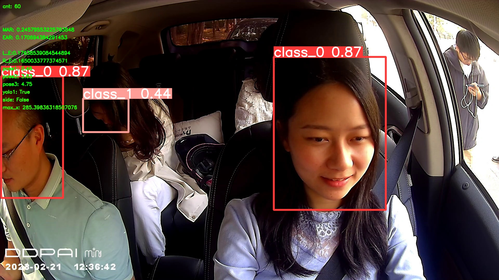

# fatigue-driving-detection-archived
[English](README.md) | [简体中文](README.zh-CN.md)

Project for the Challenge Cup 2023 Huawei Industrial Contest: **Fatigue Driving Detection**

Knowledge stacks involved include: Face detection, Facial keypoint recognition, Sequential judgement.

---

## Model Description

For the key models, we've tried the following:

1. YOLOv5 + Dlib
2. YOLOv5 + SPIGA
3. YOLOv7 + SPIGA
4. **YOLOv7 + Renita (baseline)**
5. YOLOv8 + SPIGA
6. **YOLOv8 + Renita (last submit)**
    
    ---
    

## Parameter Tuning Experience

- The **YOLOv5s** model is slightly inferior to **YOLOv8n** in terms of both **accuracy** and **speed**.
  
- The **YOLOv7** model has a training time several times longer than a similar parameter model of v8.

- **SPIGA** is a SOTA model for facial keypoint detection, but obviously, the SOTA is the **accuracy** on large datasets, not **accuracy/performance**. Its average inference speed per frame on the official required hardware (an old 2-core 8GB cpu) reached an astonishing ***1.404s per frame***(*😓). It was eventually eliminated due to its poor edge deployment capability.
> Just so you know, at 640 x 640
> 
> YOLOv8: 230ms per frame
> 
> Renita: 56ms per frame
> 
- **Renita** is a model reference provided by the official Baseline, and is the model we finally chose. This model performs well in a car interior environment where the occlusion and lighting conditions are not complicated.

---

## A Quick Tour of Our Files

BaselineLandmark/detectionx.2: Our final bow

submit/detection8: The last act of YOLOv8 + SPIGA

BaselineLandmark/makeup: Our backstage pass for tweaking Retina + YOLOv8

---

## Fun Facts

**Why does the main code look like a huge pile? Don't we do any encapsulation?**

- Our main program, in a bid to stick close to the baseline submission format and make tuning easier, stayed away from encapsulation. *Even though it looked similar to the baseline, the main program was written without any peeking at it, which gave the person who started porting quite a headache.*
- And with this whole project being a **solo gig** and a **linear job**, everyone knew their roles inside out, so there was no need to worry about others not getting it. Everyone **simply didn't have the time or energy**~~and let's be honest, nobody was reading it except me~~.

> The best way to divide the work? One person covers all bases.
> 

**How'd we fare in the competition?**

The competition judged us on F1-Score (accuracy) and speed. On the facial keypoint front, by pulling in sequential pattern recognition, we managed to cover all bases.

**Any hurdles during the competition?**

- The size of the dataset was a beast (2066 * 8s video sequences)
- Doc of Huawei Cloud ModelArts' online deployment feature (which we had to use for submission) was as clear as mud - practically nothing was there. We had to play detective and figure out how it works before we could make a stable submission 😓.
